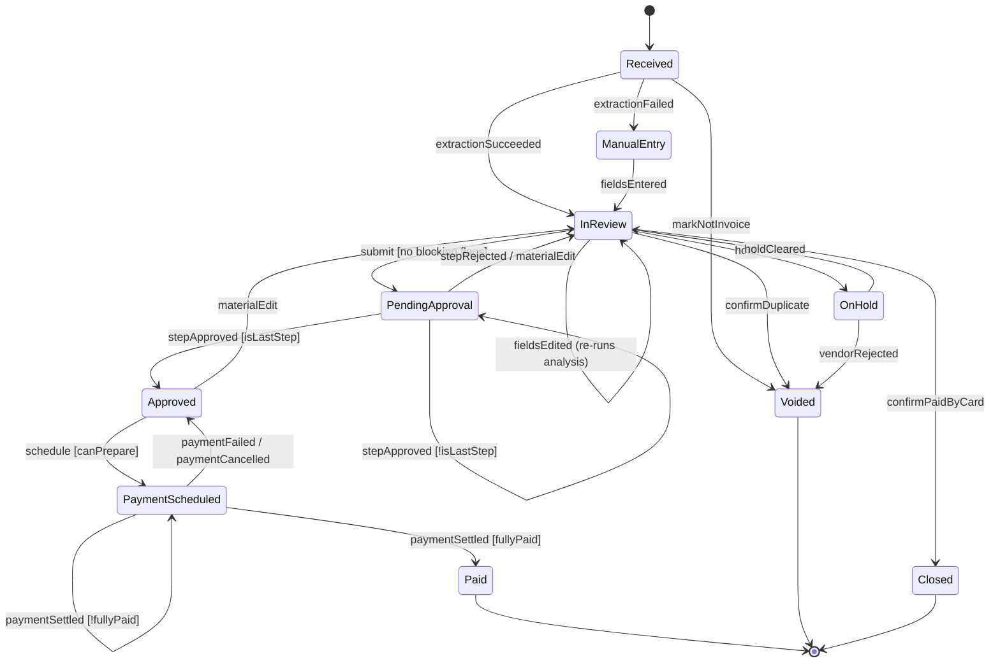
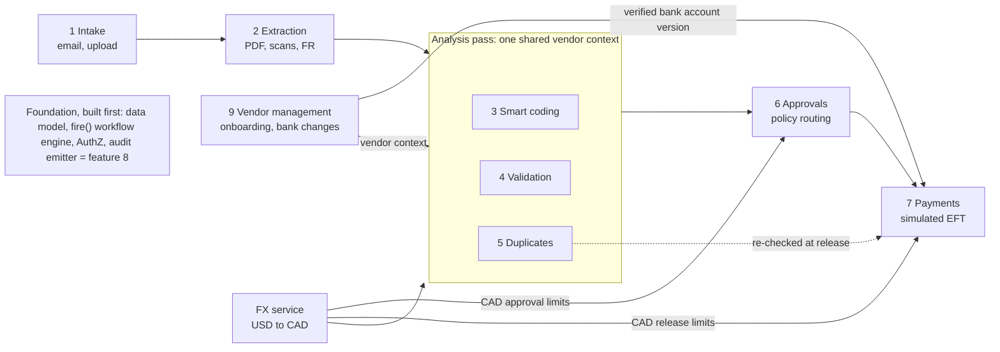

# Brim AP Automation — Diagrams

## 1. Invoice state machine

```mermaid
stateDiagram-v2
    [*] --> Received
    Received --> InReview : extractionSucceeded
    Received --> ManualEntry : extractionFailed
    Received --> Voided : markNotInvoice
    ManualEntry --> InReview : fieldsEntered
    InReview --> InReview : fieldsEdited (re-runs analysis)
    InReview --> PendingApproval : submit [no blocking flags]
    InReview --> OnHold : hold
    InReview --> Voided : confirmDuplicate
    InReview --> Closed : confirmPaidByCard
    OnHold --> InReview : holdCleared
    OnHold --> Voided : vendorRejected
    PendingApproval --> PendingApproval : stepApproved [!isLastStep]
    PendingApproval --> Approved : stepApproved [isLastStep]
    PendingApproval --> InReview : stepRejected / materialEdit
    Approved --> PaymentScheduled : schedule [canPrepare]
    Approved --> InReview : materialEdit
    PaymentScheduled --> PaymentScheduled : paymentSettled [!fullyPaid]
    PaymentScheduled --> Paid : paymentSettled [fullyPaid]
    PaymentScheduled --> Approved : paymentFailed / paymentCancelled
    Paid --> [*]
    Voided --> [*]
    Closed --> [*]
```

## 2. Feature dependency graph

```mermaid
flowchart LR
    I["1 Intake<br/>email, upload"] --> E["2 Extraction<br/>PDF, scans, FR"]
    E --> A
    subgraph A["Analysis pass: one shared vendor context"]
        direction TB
        C["3 Smart coding"]
        V["4 Validation"]
        D["5 Duplicates"]
    end
    A --> AP["6 Approvals<br/>policy routing"]
    AP --> P["7 Payments<br/>simulated EFT"]
    VM["9 Vendor management<br/>onboarding, bank changes"] -->|vendor context| A
    VM -->|verified bank account version| P
    FX["FX service<br/>USD to CAD"] --> A
    FX -->|CAD approval limits| AP
    FX -->|CAD release limits| P
    D -.->|re-checked at release| P
    F["Foundation, built first: data model, fire() workflow engine, AuthZ, audit emitter = feature 8"]
```
